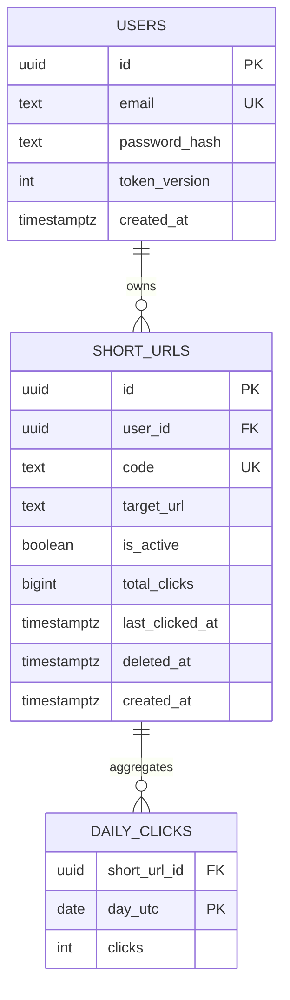
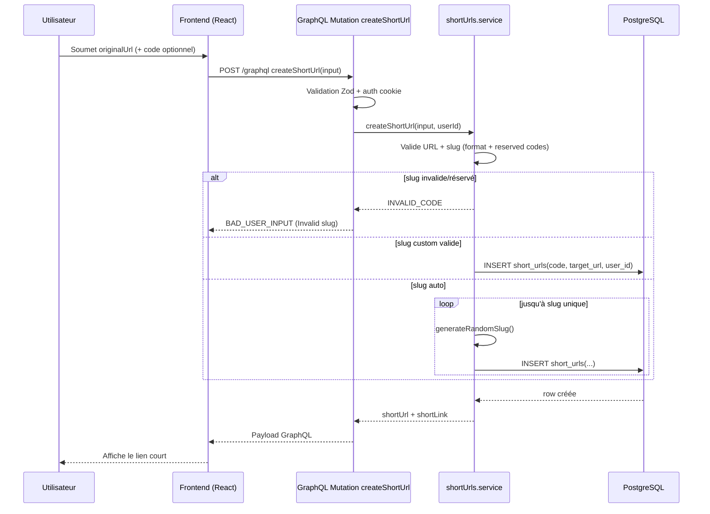
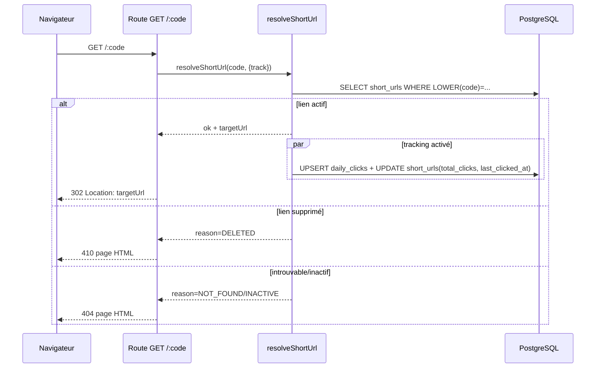

# Fliro — URL Shortener (Fullstack Portfolio Project)


**Live App** [https://app.fliro.cc](https://app.fliro.cc)

Fliro est une application fullstack de raccourcissement d’URL développée comme projet portfolio.

Il met en avant une architecture TypeScript claire, une API GraphQL,
une base PostgreSQL avec migrations, ainsi que des bonnes pratiques
de sécurité et de CI.

## Objectif

Ce projet sert de support pour démontrer :

- la conception d’une application fullstack TypeScript
- la mise en place d’une API GraphQL
- la gestion d’une base PostgreSQL avec migrations
- l’implémentation de mesures de sécurité applicative
- la mise en place d’un pipeline CI

## Stack

- **Frontend** : React 19, Vite, TypeScript, React Router, React Query, Tailwind
- **Backend** : Node.js, Express 5, Apollo Server (GraphQL), TypeScript, Zod (validation)
- **Base de données** : PostgreSQL + dbmate (SQL migrations)
- **CI** : GitHub Actions
- **Déploiement** :
  - Frontend sur **Netlify**
  - Backend + DB sur **Railway**

## Architecture du repo

```text
apps/
  frontend/   # UI React
  backend/    # API GraphQL + redirection /:code
.github/
  workflows/  # CI frontend/backend
```

## Démarrage local

### Prérequis

- Node.js 20+
- pnpm 10+
- PostgreSQL

### 1) Installer les dépendances

```bash
pnpm install
```

### 2) Configurer les variables d’environnement

Backend :

```bash
cp apps/backend/.env.example apps/backend/.env
```

Frontend :

```bash
cp apps/frontend/.env.example apps/frontend/.env
```

### 3) Appliquer les migrations

```bash
pnpm --filter ./apps/backend db:migrate
```

### 4) Lancer en développement

```bash
pnpm dev
```

- Front : http://localhost:5173
- Back GraphQL : http://localhost:4000/graphql

## Scripts utiles

```bash
pnpm -r lint
pnpm -r typecheck
pnpm -r test
pnpm -r build
```

## Features

- Inscription / connexion / déconnexion
- Création de short links (slug custom optionnel)
- Liste paginée des liens utilisateur
- Suppression logique de liens
- Redirection courte URL (`/:code`)
- Statistiques de clics (total, dernier clic, graphique 7 / 30 jours)

## Base de données

Le modèle est simple et orienté besoin produit :

- `users` : comptes utilisateurs, hash de mot de passe, version de token
- `short_urls` : liens raccourcis, slug, URL cible, état actif/supprimé, compteurs
- `daily_clicks` : agrégats journaliers de clics pour l’analytics

Notes techniques :

- index sur le slug (`LOWER(code)`) pour l’unicité et la recherche,
- relation utilisateur → liens,
- table d’agrégats séparée pour éviter de recalculer l’historique au runtime.



Le backend persiste 3 tables : comptes (`users`), liens (`short_urls`) et agrégats journaliers (`daily_clicks`). La suppression d’un lien est logique (`deleted_at` + `is_active=false`), pas un DELETE physique.

## Flux de l’application

### Création d’un lien

1. L’utilisateur envoie l’URL (et éventuellement un slug custom) via le front.
2. Le backend valide l’entrée (Zod), puis crée l’enregistrement en base.
3. Le front affiche le short link généré.



La création passe toujours par `createShortUrl` côté GraphQL, puis par un service métier qui gère les validations métier et les collisions d’unicité du slug.

### Redirection

1. Requête sur `/:code`.
2. Le backend résout le code, vérifie l’état du lien, puis redirige en 302.
3. Le clic est tracké (compteur total + agrégat journalier).



La redirection est une route HTTP Express séparée de GraphQL.
Le clic est enregistré en arrière-plan (sans bloquer la réponse 302).
Le tracking est désactivé pour les requêtes spéculatives du navigateur
(prefetch/prerender) afin d’éviter de compter des visites non réelles.

### Stats

Le frontend interroge la query GraphQL `linkStats`.
Le backend lit les agrégats `daily_clicks` et retourne les clics par jour, le total de clics et la dernière activité.

## Sécurité

- Validation d’entrée avec Zod
- Authentification JWT en cookie HttpOnly
- Invalidation de session via `token_version`
- Rate limiting sur endpoints sensibles (auth, création, redirection)
- CORS par allowlist
- Security headers (HSTS, CSP, etc.)

## Notes production

Le `.env.example` est pensé pour le local. En prod, il faut surtout vérifier :

- `COOKIE_SECURE=true`
- origins CORS correctes
- `JWT_SECRET` fort
- `PUBLIC_BASE_URL` aligné avec le domaine public

---
